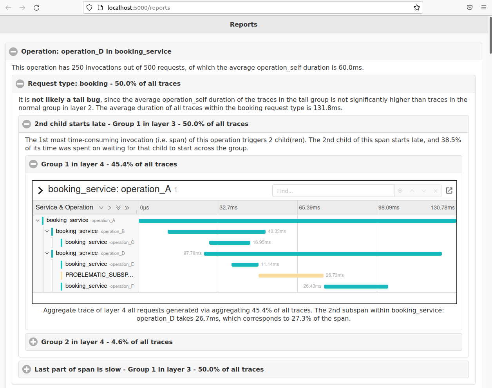

# tprof

tprof is a distributed systems performance profiler powered by the core ideas of structural aggregation and automated analysis of distributed systems traces.

## How to run
Requirement: Ubuntu 20.04

```
./start.sh
```

This script should take care of installing all the required packages and running through the process to generate demo bug reports looking like this:



Please note that the applications included in this repo are for demo purposes, and you can check out the following paper for detailed evaluation on complex microservice systems.

## Publication
["[ACM SoCC'21] tprof: Performance profiling via structural aggregation and automated analysis of distributed systems traces"](https://dl.acm.org/doi/10.1145/3472883.3486994)

Authors: Lexiang Huang, Timothy Zhu (Penn State University)

Please cite our work if you find it useful:
```
@inproceedings{10.1145/3472883.3486994,
author = {Huang, Lexiang and Zhu, Timothy},
title = {Tprof: Performance Profiling via Structural Aggregation and Automated Analysis of Distributed Systems Traces},
year = {2021},
isbn = {9781450386388},
publisher = {Association for Computing Machinery},
address = {New York, NY, USA},
url = {https://doi.org/10.1145/3472883.3486994},
doi = {10.1145/3472883.3486994},
abstract = {The traditional approach for performance debugging relies upon performance profilers
(e.g., gprof, VTune) that provide average function runtime information. These aggregate
statistics help identify slow regions affecting the entire workload, but they are
ill-suited for identifying slow regions that only impact a fraction of the workload,
such as tail latency effects. This paper takes a new approach to performance profiling
by utilizing distributed tracing systems (e.g., Dapper, Zipkin, Jaeger). Since traces
provide detailed timing information on a per-request basis, it is possible to group
and aggregate tracing data in many different ways to identify the slow parts of the
system. Our new approach to trace aggregation uses the structure embedded within traces
to hierarchically group similar traces and calculate increasingly detailed aggregate
statistics based on how the traces are grouped. We also develop an automated tool
for analyzing the hierarchy of statistics to identify the most likely performance
issues. Our case study across two complex distributed systems illustrates how our
tool is able to find multiple performance issues that lead to 10x and 28x performance
improvements in terms of average and tail latency, respectively. Our comparison with
a state-of-the-art industry tool shows that our tool can pinpoint performance slowdowns
more accurately than current approaches.},
booktitle = {Proceedings of the ACM Symposium on Cloud Computing},
pages = {76–91},
numpages = {16},
keywords = {distributed systems tracing, performance debugging},
location = {Seattle, WA, USA},
series = {SoCC '21}
}
```

## Disclaimer
The api_v2, googleapis, grpc-gateway and jaeger in this repo are third-party modules whose owners hold the copyrights. 